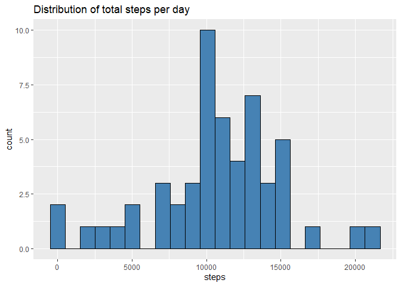
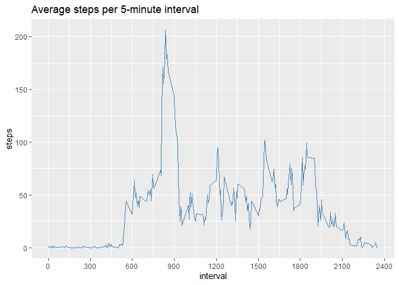
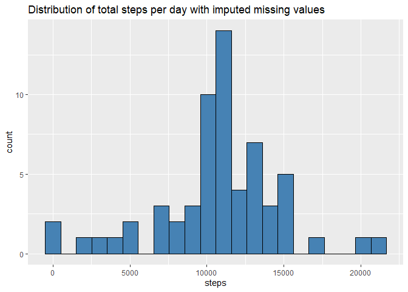
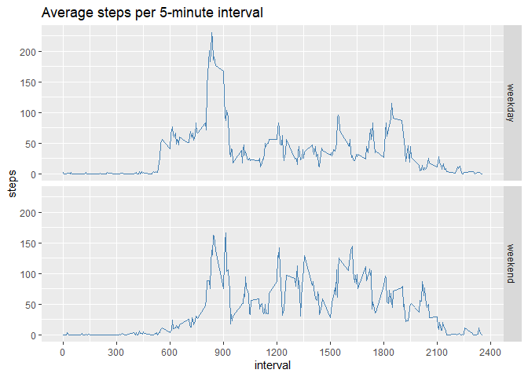

## Setup

As a first step let's set the code chunks options in this R markdowwn document to echo = TRUE.


```r
knitr::opts_chunk$set(echo = TRUE)
```

Let's also load all of the libraries that we will be using for this assignment.


```r
library(readr)
library(dplyr)
library(ggplot2)
```

```
## Warning: package 'ggplot2' was built under R version 4.2.2
```

```r
library(lubridate)
```

```
## Warning: package 'lubridate' was built under R version 4.2.2
```

```
## Warning: package 'timechange' was built under R version 4.2.2
```


## Loading and preprocessing the data

Here we download and list the contents of the zip file.


```r
url <- "https://d396qusza40orc.cloudfront.net/repdata%2Fdata%2Factivity.zip"
destfile <- "./data/05_assignment1_data.zip"
download.file(url, destfile)
unzip("./data/05_assignment1_data.zip", list = TRUE)
```

```
##           Name Length                Date
## 1 activity.csv 350829 2014-02-11 10:08:00
```


Next we unzip and read the dataset into an R dataframe


```r
activity_df <- read_csv(unzip("./data/05_assignment1_data.zip", "activity.csv", exdir = "./data"))
```

## What is mean total number of steps taken per day?

Let's have a look at our dataframe.


```r
str(activity_df)
```

```
## spc_tbl_ [17,568 × 3] (S3: spec_tbl_df/tbl_df/tbl/data.frame)
##  $ steps   : num [1:17568] NA NA NA NA NA NA NA NA NA NA ...
##  $ date    : Date[1:17568], format: "2012-10-01" "2012-10-01" ...
##  $ interval: num [1:17568] 0 5 10 15 20 25 30 35 40 45 ...
##  - attr(*, "spec")=
##   .. cols(
##   ..   steps = col_double(),
##   ..   date = col_date(format = ""),
##   ..   interval = col_double()
##   .. )
##  - attr(*, "problems")=<externalptr>
```

```r
head(activity_df)
```

```
## # A tibble: 6 × 3
##   steps date       interval
##   <dbl> <date>        <dbl>
## 1    NA 2012-10-01        0
## 2    NA 2012-10-01        5
## 3    NA 2012-10-01       10
## 4    NA 2012-10-01       15
## 5    NA 2012-10-01       20
## 6    NA 2012-10-01       25
```

We see that there are 17,568 rows and three columns: **steps** in numeric format, **date** in date format and **interval** in numeric format. We also appreciate that there are some NA values in the **date** column. 

Now let's calculate the total number of steps taken each day.

The following code groups the data by date and then calculates the total number of steps for each day, producing a dataframe with 61 rows (dates from 1 October 2012 to 30 November 2012) and two columns (dates and steps).


```r
steps_day <- activity_df %>% 
        group_by(date) %>% 
        summarise(
        steps = sum(steps)
)
steps_day
```

```
## # A tibble: 61 × 2
##    date       steps
##    <date>     <dbl>
##  1 2012-10-01    NA
##  2 2012-10-02   126
##  3 2012-10-03 11352
##  4 2012-10-04 12116
##  5 2012-10-05 13294
##  6 2012-10-06 15420
##  7 2012-10-07 11015
##  8 2012-10-08    NA
##  9 2012-10-09 12811
## 10 2012-10-10  9900
## # … with 51 more rows
```

Now we simply use the summary function to calculate the mean and the median of the total number of steps taken per day.


```r
summary(steps_day$steps)
```

```
##    Min. 1st Qu.  Median    Mean 3rd Qu.    Max.    NA's 
##      41    8841   10765   10766   13294   21194       8
```

The mean of 10766 and the median of 10765 show a fairly central distribution of the data.


Let's now see how that looks in the histogram of the total number of steps taken each day.


```r
ggplot(steps_day, aes(x=steps)) + 
        geom_histogram(bins = 22, color = "black", fill = "steelblue") + 
        ggtitle("Distribution of total steps per day")
```

```
## Warning: Removed 8 rows containing non-finite values (`stat_bin()`).
```

<!-- -->

As we might have expected from the summary of the data, the histogram shows a fairly normal distribution around a total of 10,000 steps per day.


## What is the average daily activity pattern?


The following code groups the data by interval and then calculates the average number of steps for each interval, producing a dataframe with 288 rows (number of 5-minute intervals in each day) and two columns (interval and steps).

Then we find the 5-minute interval with the maximum average number of steps.


```r
by_interval <- activity_df %>%
        group_by(interval) %>%
        summarise(
                steps = mean(steps, na.rm = TRUE)
        )
by_interval[which.max(by_interval$steps), ]
```

```
## # A tibble: 1 × 2
##   interval steps
##      <dbl> <dbl>
## 1      835  206.
```

As we can see the interval with the maximum average number of steps (206 steps) occurred at interval 835, i.e. on average the subject was most active between 8:35 and 8:40 am across the two months in question.


In the time series chart below we can clearly see how the subject was most active on average in the morning  around 8:30 am.


```r
ggplot(by_interval, aes(x=interval, y=steps)) + 
        geom_line(color = "steelblue") + 
        ggtitle("Average steps per 5-minute interval") + 
        scale_x_continuous(breaks=seq(0,2400,300))
```

<!-- -->


## Imputing missing values

First of all, let's calculate the number of missing values in the steps column.


```r
sum(is.na(activity_df$steps))
```

```
## [1] 2304
```

Well, that's quite a lot of missing values!

Let's replace them now with the mean value for that 5-minute interval. The code below does just that, first by grouping the data according to interval and then checking for NA values and when found replacing them with the mean number of steps for that interval.


```r
replaced_missing <- activity_df %>%
        group_by(interval) %>%
        mutate_if(is.numeric,
                 function(x) ifelse(is.na(x),
                                    mean(x, na.rm = TRUE),
                                    x)) 
```

```
## `mutate_if()` ignored the following grouping variables:
## • Column `interval`
```

Now let's calculate the mean and median number of steps per day in the new dataframe with the replaced missing values. First we need to ungroup the dataframe (as we had grouped it by interval) and then group it by date. Next we calculate the total number of steps per day and lastly use the summary function to display the mean and median.


```r
steps_day_no_na <- replaced_missing %>%
        ungroup(interval) %>%
        group_by(date) %>%
        summarise(
        steps = sum(steps)
)
summary(steps_day_no_na$steps)
```

```
##    Min. 1st Qu.  Median    Mean 3rd Qu.    Max. 
##      41    9819   10766   10766   12811   21194
```

We can immediately see that there is no difference at all to the mean and only a slight difference to the median. We can however observe some difference in the 1st (8841 to 9819) and 3rd (13294 to 12811) quartile figures. So the impact of replacing the missing values with mean values has pushed the data more towards the mean.


Now let's plot the histogram of the total number of steps with the imputed missing values.


```r
ggplot(steps_day_no_na, aes(x=steps)) + 
        geom_histogram(bins = 22, color = "black", fill = "steelblue") + 
        ggtitle("Distribution of total steps per day with imputed missing values")
```

<!-- -->

We can see that the data has to a certain extent been 'normalised' with a more even distribution around the centre.


## Are there differences in activity patterns between weekdays and weekends?

First up let's add a column to our dataframe with the imputed missing values to show whether the date is a weekday or a weekend. Using the lubridate function wday() we add a column with the day of the week as a numeric value (1-5 for Monday to Friday, 6-7 for Saturday and Sunday). Then we replace the numeric valued with the string weekday or weekend.


```r
replaced_missing_wd <- replaced_missing %>%
        mutate(day_of_week = wday(date, week_start = 1)) %>%
        mutate(day_of_week = ifelse(day_of_week < 6, "weekday", "weekend"))
```


Now let's group our data by both interval and the day of the week and calculate the average number of steps per interval.


```r
by_interval_wd <- replaced_missing_wd %>%
        group_by(interval, day_of_week) %>%
        summarise(
                steps = mean(steps, na.rm = TRUE)
        )
```

```
## `summarise()` has grouped output by 'interval'. You can override using the
## `.groups` argument.
```

Lastly let's plot the average steps per 5-minute interval in two panels to compare the weekday activity against the weekend.


```r
ggplot(by_interval_wd, aes(x=interval, y=steps, group=day_of_week)) +
        geom_line(color = "steelblue") + 
        ggtitle("Average steps per 5-minute interval") + 
        scale_x_continuous(breaks=seq(0,2400,300)) +
        facet_grid(day_of_week ~ .)
```

<!-- -->

From the chart above we can see that the subject is less active early in the morning on the weekends but generally more active throughout the day. We can probably assume that the subject works Monday to Friday in a relatively sedentary job.
